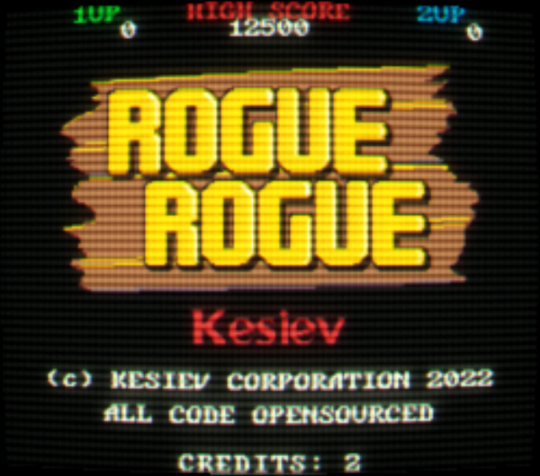
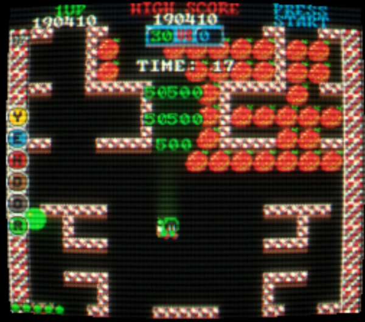
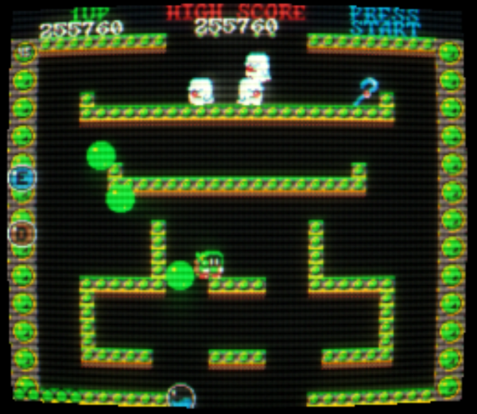
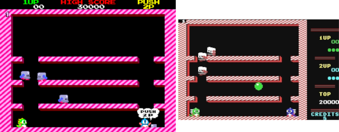
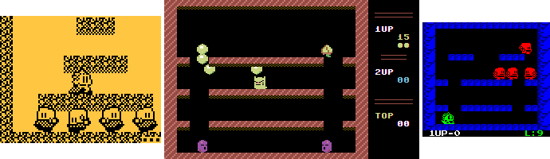
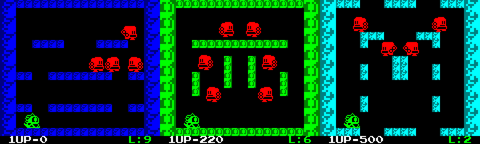
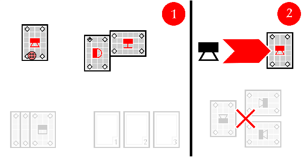
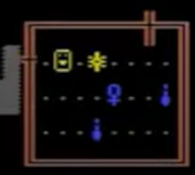

# Rogue Rogue

    

---

    <a href="https://www.kesiev.com/roguerogue/">Play!</a> 

---

**Rogue Rogue** is a secrets-packed roguelite single-screen platformer arcade game for 1-2 players heavily inspired by the 1986 Taito masterpiece [Bubble Bobble](https://en.wikipedia.org/wiki/Bubble_Bobble) and other great games from the past.

    

The little green and blue Rogues have to steal the [Yendor's Amulet](https://en.wikipedia.org/wiki/NetHack) from the depths of a mysterious cave to make their wishes come true... or not?

The game 100-stages set is procedurally generated using a different seed every week, so you've from Monday to Sunday days to clear it. Every run you've 3 lives and 2 credits available but the game will also give you an extra credit every week you come back playing.

    

As the original game, **Rogue Rogue** is packed with secrets, many of them inspired by my life and the people I've met... Can you find them all (without spying on the source code)?

    

## Gameplay & Controls

You can configure keyboard controls just before starting the game. You can also plug up to 2 gamepads to play the game.

### Tips & Tricks

  - As for old arcade games, Rogue Rogue has [attract modes](https://en.wikipedia.org/wiki/Glossary_of_video_game_terms#attract_mode): wait a little on the title screen to see them
  - The little Rogues can fire bubbles also up and down, holding down the up or down direction and firing
  - They can also jump over bubbles by holding the jump button down
  - In some later stages, enemies may look impossible to reach. The little Rogues are more agile than their _draconic cousins_ and they may hide some trick up their (very large) sleeves...

## Why?

One day I just wanted to play a roguelite single-screen platformer for no reason. I played Bubble Bobble on my Commodore 64 as a kid and the arcade one as a teenager and, in a way, these two versions became the symbol of the slow, warm comfort of home, and the fast-paced thrill of growing up. I'm 40+ now, things got faster, chaotic, challenging, and unknown.

    

    
Bubble Bobble: the arcade version on the left and the Commodore 64 conversion on the right.

The old good [The Bub's Brothers](https://bub-n-bros.sourceforge.net/) slow pace doesn't suit me anymore and I've already worked on tribute games [so](http://www.kesiev.com/oldsite/jubble.htm) [many](http://www.kesiev.com/wright/issue/starcatbolle) [times](https://github.com/kesiev/rewtro/blob/master/carts/K-008-bubbypop.json). The time was right to make a new game by myself.

    

    
Jubble Bobble running on a Samsung SL45i cellphone, Starcat Bolle running on a web browser as part of the Wright project, and Bubby Pop executed by the Rewtro web QR-Code based fantasy console.

I've already attempted _procedurally generated_ stages on a single-screen platformer with my **Rewtro demake** of Bubble Bobble. [Rewtro](https://github.com/kesiev/rewtro) is a fantasy console I made in 2019 that loads the game code, graphics, and sounds from QR-Codes. To fit the remake in so little space I had to find a way to _compress_ the stage data. I ended up splitting the stages into chunks and mirroring/rotating them semi-randomly using a fixed seed... and it worked pretty nicely.

    

    
The first 3 stages of Bubby Pop, a Bubble Bobble demake for Rewtro. These stages are generated by transforming handcrafted map halves in different ways.

I recently worked on a print-and-play procedurally generated dungeon crawler called [Travelers Of Stampadia](https://github.com/kesiev/stampadia-travelers) that used a similar way to create a relatively large dungeon using 6 cards... so why not try _smashing these experiments together?_

    

    
An image from the Travelers Of Stampadia physical card game manual. The same Room Cards are rotated to create different rooms and arranged together in a large dungeon.

One of the things I like the most about single-screen platformers is that the stages often require a certain strategy to be completed, which the player develops game after game. Furthermore, the distinctive character of a stage, in addition to its layout and its strategy for solving it, is the tileset used to represent it.

Although Rogue Rogue is a procedural game, I still wanted to keep these features: the game does not randomly generate every stage every time but prepares a set of stages using a different seed every week, so for 7 days the whole game remains the same, both in the stage structure and in the graphics. So you've 7 days to replay and memorize them, get better, and clear the game!

I was happy about the end results so I've tried to add more gameplay styles, some original and some others inspired by other arcade games I've thrown quarters at. I've scrapped some ideas and adapted some others due to the different level design rules of their original games. The ending result gave me a warming [vaporwave](https://en.wikipedia.org/wiki/Vaporwave) effect: a nostalgic feeling of something of the past that never was. I've decided to keep and hide them somewhere in the game. I'd like to add a screenshot here but hey... _no spoilers_. I hope you'll play the game long or good enough to eventually meet them!

Speaking of secrets, I miss the [Wright](https://github.com/kesiev/wright) project, in which I used to talk about the stuff of my life making tiny video games. A game filled with secret counters, cheat codes, and secret rooms is the perfect _canvas_ for storing my memories here and there.

## FAQs

**Q: Why the female symbol &female; is used in multiple places of the game?**

A: Rogue Rogue pays homage to the 80's text-based dungeon crawler [Rogue](https://en.wikipedia.org/wiki/Rogue_(video_game)). In that game, the player explores several procedurally-generated levels of a dungeon seeking the Amulet of Yendor, which is displayed as the &female; symbol.

    

    
Rogue's Amulet Of Yendor.

**Q: Is there a kiosk mode?**

Yes! You can run the game on Google Chrome via game launchers like [Playnite](https://playnite.link/) with a command like ``<your Chrome path>/chrome.exe -kiosk --autoplay-policy=no-user-gesture-required "<your Rogue Rogue installation>/index.html#kiosk"``. The game will autostart and quit holding down the "Start" button for 3 seconds.

## Credits

### Code

  - The CRT effect comes from the really nice [Death Game](https://github.com/malec-palec/death-game) platformer game by [Gleb Volkov](https://github.com/malec-palec)
  
### Music

  - I've used "[Chiptune Adventures](https://opengameart.org/content/4-chiptunes-adventure)" set by Juhani Junkala
  - I've also used the "Witch's Lair" song from the [JRPG Pack 3 Evil](https://opengameart.org/content/jrpg-pack-3-evil) set by Juhani Junkala
  - There is the "[8Bit Bossa](https://opengameart.org/content/bossa-nova)" song by Joth
  - There is the "[Free Run [8 bit(ish)]](https://opengameart.org/content/free-run-8-bitish)" song by TAD
  - I've used the "[Overdrive](https://opengameart.org/content/overdrive)" song by Centurion of war
  
### Graphic

  - I've used the "[Anvil](https://damieng.com/typography/zx-origins/anvil/)" font by Damieng
  - There also is the "[Tom Thumb Tiny ASCII Font (3x5)](https://opengameart.org/content/tom-thumb-tiny-ascii-font-3x5)" by Robey Pointer

### Thanks

  - [Bianca Brenna](http://www.linearkey.net/)
  - Giuseppe "Morpheus" La Scala
  - Clara "[Ikigai](https://www.facebook.com/ikigaicustom)" Mazzoleni
  - All my friends and families. I'm pretty sure that there is something about us hidden somewhere in this game.
